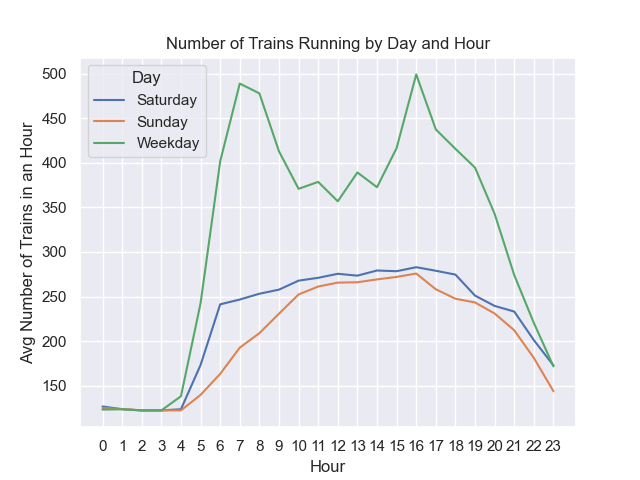
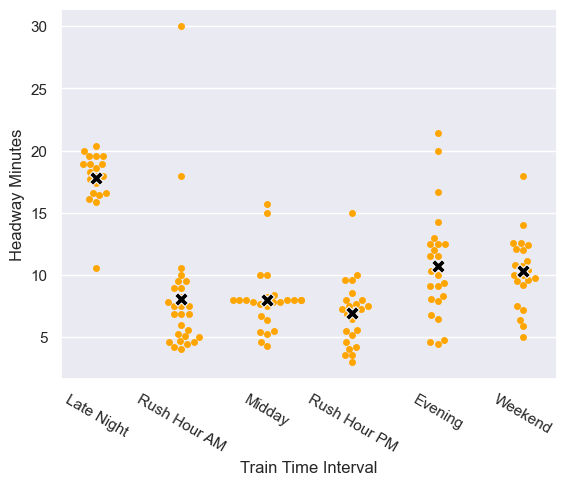
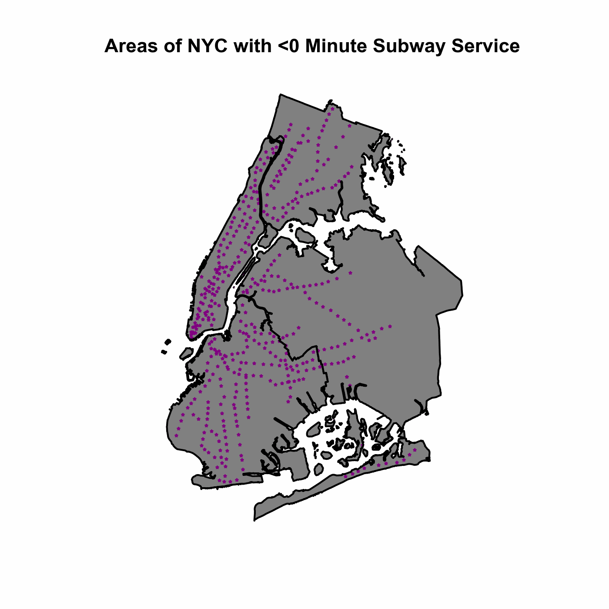

# NYC Subway Frequencies

## Introduction
New Yorkers can have strong opinions about the NYC Subway services. "The 4 is so much better than the 6. It's not even close". "Ugh, I hate riding the F train. It takes forever". Someone was so frustrated with the G train that they wrote a (dare I say, relatable) [song](https://youtu.be/_OhUIVsUkxg?si=fQvYZA07SlQRk1pk) about it.  

So why *do* New Yorkers have such strong opinions about certain services? Are there actual, tangible differences between them? In this project **I examine the verifiable frequency differences between the 28 services in the NYC subway system**. In particular, I focus on the frequencies that these trains have at different points in the schedule. The daily, hourly and time interval frequencies are all examined using the [GTFS schedule data](https://new.mta.info/developers). In addition, I touch on the capacity of each service, station-specific information and other fun trivia I discovered along the way. 

## Train Frequencies

### Number of Train sets Running at One Time
The primary question that sparked this project is this: **how many train sets are running in the NYC subway system at any one time?**. While this seems like a simple question, it's surprisingly complex: given a schedule, how do we know that a train is running at the exact time that we're investigating? How can scale our investigation to all hours of the day? My approach was to find the length of time it takes to run a route (one terminal to the other) and divide that by the hourly tph. With this, I am able to determine the average number of trains running at that hour. 

I found that there are an average of around 284 train sets running at any one time in the NYC Subway! That's a ton of equipment being moved! Further, during afternoon rush hour on weekdays (4 p.m. to be exact) there can be up to 490 train sets running at once! On the other end of the spectrum, as few as 119 train sets can be running. Still quite an impressive feat! See the below chart for how the number of trains running in the NYC Subway vary by day and hour:

Once can clearly see the increase in service that a.m. and p.m. rush hours get during weekdays. Additionally, one can see the evenness that all late night service gets, no matter the day of the week.

### Service by Different Time Periods 
Speaking of service by time period, It may be easier to divide the train schedule into time intervals (see this [wikipedia article](https://en.wikipedia.org/wiki/List_of_New_York_City_Subway_services#Train_intervals) for a breakdown). These train service intervals include: Rush Hour a.m., Rush Hour p.m., Midday, Weekend, Evening, and Late Night. Let's see how service differs for each of these: 

This puts it even more into perspective how the wait time will differ depending on when you access the train. On average, people will wait 3 times as long for a train late night as compared to during either rush hour!

### Service Level Comparison
All subway services are most frequent during rush hours (6:30 - 9:30 a.m. and 3:30 - 8 p.m.). Using these time periods, I will show the amount of time between each scheduled train for each service so that we can compare the services: 

As you can see, there's quite a lot of variation in the amount of time you might wait for a subway! The "H" train (Rockaway Shuttle) can make you wait up to about 17 minutes while the 7 will have you waiting less than 3 minutes. That's quite the difference! In between these two extremes, there's many shades of grey. In my personal experience, I was a frequent user of the G and have now switched to using the L. This project has finally confirmed my suspicions about the waiting time for these services: the worst case waiting time for the L is the normal waiting time for the G.

### The 15 Minute (Subway) City
Recently there's a lot of talk about the ["15 minute city"](https://en.wikipedia.org/wiki/15-minute_city). The idea of this is that many essential services can be found within 15 minutes of your home. I wanted to extend this concept to transit: how much time does it take for someone living in a certain location to access reliable rapid transit? In this case, being near a station isn't enough: the person needs to also enter the train and get moving to their destination. To visualize this, I use the average train frequency for a station's all non-late night hours and the constant walking speed of 3 miles per hour. I then can calculate the area around a station that will allow someone to enter a moving train at that amount of time or less. The white areas in this gif allow someone to enter a train in a given amount of time:

As you can see, some stations are much more desirable to live near than others. Just to take a clear example, being at the end of the Bay Ridge services (far bottom left in Brooklyn) is much worse than being near Coney Island (far bottom of greyed-out Brooklyn) even though both are terminal stations: the Coney Island station has a visible catchment area starting at 5 minutes whereas the Bay Ridge one doesn't have one until 15 minutes. One obvious reason for this is that the Bay Ridge station is served by the R train whereas the Conedy Island - Stillwell Avenue station is served by the D, N, Q, F and \<F> trains. 

Moreover, one can see extremely clearly where's a (subway) transit desert and where it is clearly not -- Manhattan versus eastern Queens is night and day in terms of subway service reliability. 

## Data and Process 
This project uses GTFS schedule data to learn about the differences between NYC subway services. This data is used to determine the frequency that a service runs throughout different time periods. Additionally, this information is used to calculate the amount of service provided at each subway station.

Moreover, information about stations themselves are taken from two open data sources: 

1. [NYC Open Data Subway Hourly Ridership](https://data.ny.gov/Transportation/MTA-Subway-Hourly-Ridership-Beginning-February-202/wujg-7c2s/about_data)
2. [MTA Subway Stations](https://data.ny.gov/Transportation/MTA-Subway-Stations-Map/p6ps-59h2)

The Hourly Ridership open dataset is queried to bring in station entrances for all stations at all hours for one whole week in March. The second dataset provides full information about all stations and complexes within the NYC subway system. This is used to aggregate stations in different lines to a single complex (e.g.: the "Whitehall St-South Ferry" complex has two stations within it: One for 1 train and one for the R and W trains).

